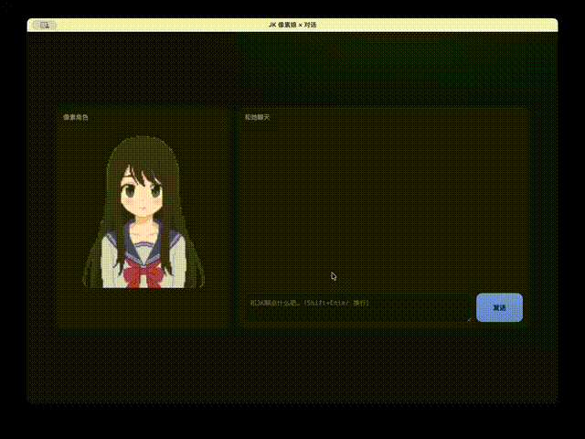

# Waifu - AI Character Chat

An Electron-based desktop application featuring an animated pixel-art character (Saki) powered by local Ollama AI models. Chat with an expressive Japanese high school girl character with dynamic facial expressions and smooth animations.



## Features

- 🎨 **Pixel Art Animation System** - Smooth sprite-based character animations with blinking and speaking states
- 😊 **Dynamic Expressions** - 10 different facial expressions triggered by AI responses (happy, angry, curious, worried, etc.)
- 🤖 **Local AI Integration** - Powered by Ollama running locally on your machine
- 💬 **Real-time Streaming** - Streaming chat responses with synchronized animations
- 🖥️ **Cross-platform** - Built with Electron for desktop deployment

## Prerequisites

**Required:**
- [Ollama](https://ollama.ai/) must be installed and running locally
- Node.js (v14 or higher)
- npm or yarn

**Ollama Setup:**
1. Install Ollama from https://ollama.ai/
2. Pull the required model:
   ```bash
   ollama pull deepseek-v3.1:671b-cloud
   ```
3. Ensure Ollama is running on `http://localhost:11434`

## Installation

```bash
# Install dependencies
npm install
```

## Usage

### Development Mode
```bash
npm run dev
```

### Build for Production
```bash
# Build for macOS
npm run build
```

The build output will be in the `dist/` directory.

## Project Structure

```
waifu/
├── app/                          # Application source
│   ├── assets/                   # Static resources
│   │   ├── sprites/              # Animation sprite sheets
│   │   └── expressions/          # Facial expression overlays
│   ├── src/                      # Source code
│   │   ├── components/           # UI components
│   │   │   ├── avatar.js         # Character animation system
│   │   │   └── chat.js           # Chat UI and logic
│   │   ├── config/               # Configuration
│   │   │   └── config.js         # App settings & constants
│   │   ├── styles/               # Stylesheets
│   │   │   └── styles.css
│   │   └── renderer.js           # Main renderer process
│   └── index.html                # Entry HTML
├── main.js                       # Electron main process
├── preload.js                    # Preload script (IPC bridge)
├── proxy.js                      # Local proxy for Ollama API
└── package.json

```

## Configuration

Edit `app/src/config/config.js` to customize:
- Ollama model (default: `deepseek-v3.1:671b-cloud`)
- Character personality in system prompt
- Expression display duration
- Animation settings

## How It Works

1. **Main Process** (`main.js`) - Creates Electron window and handles IPC communication
2. **Proxy Layer** (`proxy.js`) - Proxies requests from renderer to local Ollama API (bypasses CORS)
3. **Renderer Process** (`app/src/`) - Handles UI, animations, and chat logic
4. **Expression System** - AI responses include expression tags like `[EXP:happy]` to trigger facial animations

## Character Personality

Saki is configured as a slightly airheaded, kind, and cute Japanese high school girl who speaks Chinese with emoticons. You can customize her personality by editing the `SYSTEM_PROMPT` in `config.js`.

## License

MIT

## Author

Created for local AI-powered character interaction experiments.
